# CRV module-gap inefficiency from extrapolated cosmic tracks

*Run 124155 and the MDC2025au extracted-cosmic MC, processed 2026-10-02.*

This note reproduces R. Mina, "CRV module gap inefficiency from extrapolated tracks", [DocDB 57978](https://mu2e-docdb.fnal.gov/cgi-bin/sso/ShowDocument?docid=57978) v4 (Sep 3 2026), with the standard Offline reconstruction, EventNtuple and an uproot analysis. Straight cosmic tracks from the tracker (field off) are carried up to the CRV EX sector, about 4.4 m above it, and each EX layer is checked for an in-time pulse where the track crosses it. Comparing crossings in the 4.4 mm gaps between modules with crossings through counters measures how much the module gaps cost.

**In short.** The MC sample, the track census, the CRV timing offset and the 1.2 m tracker displacement all reproduce. The per-layer efficiency maps reproduce too, including the drop in data beyond z of about -1000 mm, which turns out to be track pointing, not the CRV. The final data/MC gap-width ratio does not reproduce. In this MC, tracks are carried up to the CRV through material that scatters them by about 50 mm (68% half-width), ten times the gap. That washes out the gap in any track-based efficiency. Integrated over the smearing, the dip appears in MC at the expected size but not in data: data 0.07 +- 0.20 mm against 0.74 mm expected. The note cannot confirm R = 0.64 +- 0.18; see Findings 5.

## Data

| sample | dataset | files | events | live time |
|---|---|---|---|---|
| data | run 124155, `raw.mu2e.trk.vst.art` | 225 | 10,603,661 | 1060 s (100 us per event) |
| MC | `mcs.mu2e.CosmicCRYExtracted.MDC2025au_best_v1_5.art`, every 25th file | 100 of 2500 | 2,893,279 | 6231 s (summed `cosmicLivetime`) |

The files are tape-backed and read in place from `/pnfs`; `scripts/filelist.py` turns names into paths and refuses files that are not on disk.

## Software

The muse workdir of [kpp-cosmics-2026-10](../kpp-cosmics-2026-10/) is used unchanged:

| repository | version |
|---|---|
| Offline | main 89bfebf + [#2022](https://github.com/Mu2e/Offline/pull/2022) = d07b6891 (#2022 matters only for calo times, not used here) |
| Production | 7d83b5f |
| mu2e-trig-config | 0a2a90e |
| EventNtuple | 7a85180; the CRV truth planes per sector (`crv.planes`) need this version or later |
| PassN | [#21](https://github.com/Mu2e/PassN/pull/21), `bonventre:tracker` 68a29c1 |

Conditions, all stopgaps:
- **Tracker:** PassN#21 has tracker tables for runs 123660 and 123680 only. `scripts/reco_124155.sh` relabels the 123680 tables to runs 124000-129999. R. Mina's data had no per-channel tracker calibration at all, which is why the slides relax the data track selection.
- **Tracker panel map:** `Offline/TrackerConditions/data/TrkPanelMap.txt`, 216 rows for runs 121700-200000. The 144-row map, which lost planes 0-1 and 8-17 in versions 1-3 of the slides, was replaced on 2026-09-19 (9b6fbe81).
- **CRV:** purpose `CRV_COMMISSIONING` v1_0 ends at run 123913, so `nearestMatch` takes the constants of the nearest preceding run.
- **MC:** the production mcs files keep only the CRV pulses that ended up in a coincidence. `fcl/nts_mc.fcl` remakes pulses and coincidences from the CRV digis, which the files keep for the primary muon, with the data's coincidence settings (EX: 3 of 4 layers, 8 PE). The CRV calibration for that is `Sim_best` v1_5, the set the MC was made with.

## Recipe

```bash
# 1. muse workdir: as in ../kpp-cosmics-2026-10, step 1 (app area, about 4 GB)
WORK=/exp/mu2e/app/users/$USER/kppwork
cd /exp/mu2e/app/users/$USER/AnalysisNotes/crv-gap-2026-10
OUT=/exp/mu2e/data/users/$USER/crv-gap-2026-10     # outputs in the data area

# 2. run 124155: combined reco (PassN#21) + EventNtuple, one job per raw file,
#    20 at a time; about 2.5 h, 4.6 GB of ntuples
scripts/reco_124155.sh $WORK $OUT/run124155 20

# 3. MC: EventNtuple with remade CRV pulses, 100 mcs files, 6 at a time; about 30 min, 4.2 GB
scripts/nts_mc.sh $WORK $OUT/mc_au 6 25

# 4. analysis (new shell, in this folder); about 10 min with -j 16
source /cvmfs/mu2e.opensciencegrid.org/bin/pyenv.sh ana
python crv_gap.py --data "$OUT/run124155/f*/nts.root" --mc "$OUT/mc_au/f*/nts.root" -o plots -j 16
```

Both processing scripts fail loudly if any job fails, keep each job's logs, and on a rerun redo only the failed jobs. The data reco writes only events with a KinematicLine track (3,760,942 events, 35%); the ntuples keep every CRV pulse (`keepUnclusteredPulses`) but no CRV waveforms and no per-hit tracker branches.

## Analysis

`crv_gap.py` (uproot, awkward, numpy, matplotlib), in the order it runs:

1. **Geometry** from the ntuple: `crvpulses.pos` is the counter centre, so the 4 x 64 EX counters, their 0.2 mm inter-dicounter gaps and 4.433 mm module gaps come out of the data and MC files themselves, and the two must agree.
2. **Tracks:** KinematicLine fits, straight line from the first `trkseg`. Selections as on the slides: data status > 0, n_active >= 10, chi2/ndof < 3, n_planes >= 3; MC the same with n_active >= 20 and fitcon > 0.01.
3. **Offsets** from the first 10 files of each sample: CRV coincidence and pulse time relative to the track, and for data the z shift of the tracker (the peak of EX coincidence z minus extrapolated track z). Data tracks are moved by that shift.
4. **Per track and EX layer:** the crossing at the layer centre, its bin (counter, inter-dicounter gap, module gap) and its signed distance to the nearest module gap. A layer is hit if an in-time pulse lies in the counter the track points at or a neighbour (the *narrow* hit, which gives the slides' efficiency maps), or within 6 counters (the *wide* hit, used for the gap width; see Findings).
5. **MC truth:** where the muon crosses the EX inner face (`crvcoincsmcplane_ex`), carried straight through the four layers, for every MC event.
6. **Effective gap width** per theta_z bin, `w = D / eps0` with `D = (1/rho) sum_d [eps0 N_den(d) - N_pass(d)]` over |d| < 300 mm, `eps0` the wide-hit efficiency at 300 < |d| < 400 mm and `rho` the crossings per mm there. The model `max(0, W - t tan(theta) + 2 l sin(theta))`, in which a layer stays silent when the track's path through either counter is shorter than `l`, is fitted to MC truth for W and l, and then to each track sample for W with l fixed. R = W(data) / W(MC, track).

## Results

Every number below comes from `plots/summary.json`. "Slides" means DocDB 57978 v4.

| quantity | slides | this note |
|---|---|---|
| MC: events, live time | 2.2M, 4751 s | 2.89M, 6231 s |
| MC: tracks/s; quality; n_planes >= 3; analysis tracks/s | 335; 16%; 73%; 39.7 | 334.5; 16.2%; 73.0%; 39.6 |
| data: events, live time | 10.6M, 1060 s | 10,603,661, 1060 s |
| data: tracks/s; quality; n_planes >= 3; analysis tracks/s | 2060; 57%; 42%; 494.8 (daqana) | 3595; 34.5%; 48.8%; 604.5 (Offline PassN#21) |
| data: EX coincidence - track, dt / dx / dz (first 10 files, tracks not shifted) | +495 +- 8 ns / -15 +- 723 / -1190 +- 72 mm | +498 +- 8 ns / -203 +- 386 / -1197 +- 24 mm |
| MC: same (first 10 files) | -15 +- 3 ns / +45 +- 361 / -10 +- 39 mm | -1 +- 2 ns / +29 +- 280 / -3 +- 11 mm |
| tracker shift in z (data tracks moved by) | -1199 mm | -1203 mm; after it the dz peak is +6 +- 24 mm |
| EX coincidence efficiency, d >= 800 mm from the edge | MC 99.1%, data 93.6% | MC 96.2 +- 0.2%, data 89.2 +- 0.2% |
| narrow-hit efficiency, counters (-2700 < z < -700) | MC reco ~83%, data ~66% | MC 83.8-84.2%, data 72.5-73.0% |
| same, module gaps | MC reco ~74%, data ~55-60% | MC 79-88 +- 3%, data 73-75 +- 2% |
| MC truth: counters / inter-dicounter gaps / module gaps | 100 / ~96 / ~67% | 100 / 95.0-97.2 / 72.1-75.0% |
| gap width W, MC truth | 4.36 +- 0.00 mm | 4.60 +- 0.08 mm (and minimum path l = 3.95 +- 0.15 mm) |
| gap width W, MC track | 4.58 +- 0.02 mm | 4.92 +- 0.77 mm |
| gap width W, data track | 2.91 +- 0.82 mm | 0.00 +- 1.51 mm (at the physical limit; all-angle w = -3.1 +- 0.8 mm) |
| R = W(data) / W(MC track) | 0.636 +- 0.178 | not determined (fit gives 0.0 +- 0.3) |
| template fit, all angles: MC track; data | | 0.43 +- 0.20 mm (expected 0.73); 0.07 +- 0.20 mm (expected 0.74) |
| MC extrapolation error at EX, 68% half-width | | 50 mm; 250 mm below 1 GeV, 12 mm above 20 GeV |

The "expected" widths are the MC-truth model averaged over each sample's own theta_z: tracks are mostly inclined beyond the 12.6 deg full-miss angle, so a 4.6 mm gap costs them only about 0.7 mm on average.

| slides | figure |
|---|---|
| 4, 22: track directions and t0, area-normalised and per live time | 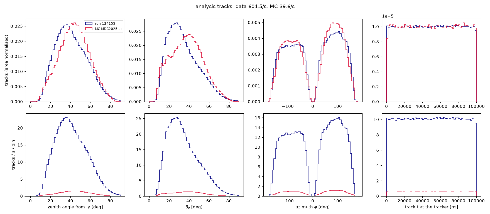 |
| 5: EX coincidence minus track | 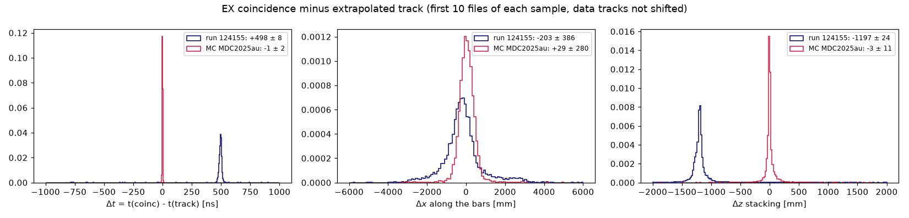 |
| 7: EX coincidence efficiency vs distance to the sector edge | 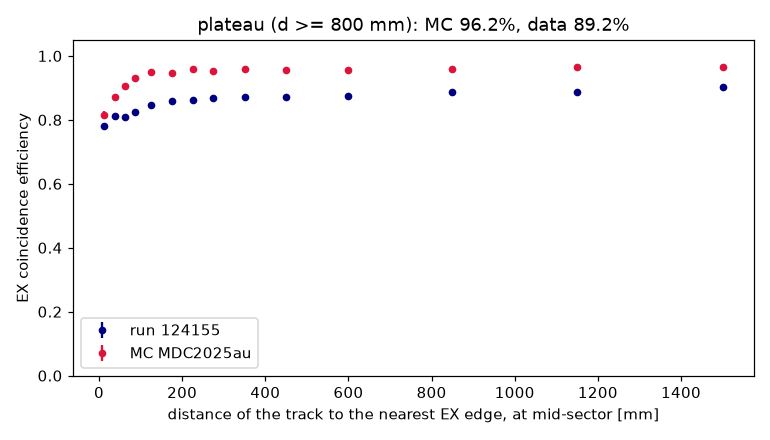 |
| 12: efficiency vs signed distance to the nearest module gap | 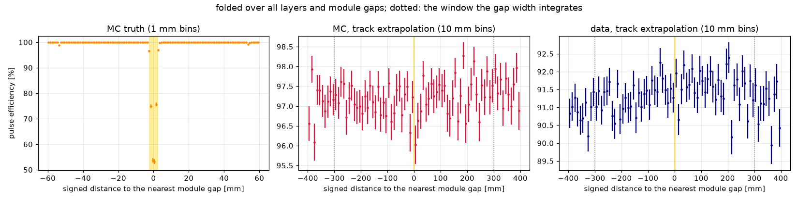 |
| 13, 15: efficiency vs z per layer and bin: MC truth, MC reco, data | 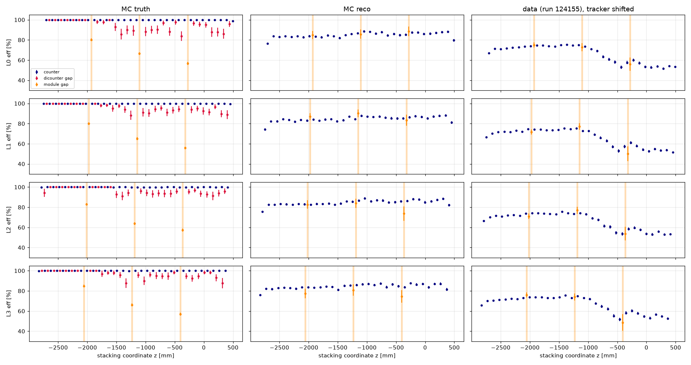 |
| 14, 17: efficiency by bin type, and MC reweighted to the data theta_z | 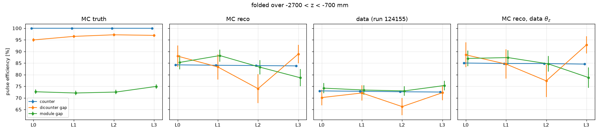 |
| 16: theta_z of the layer crossings | 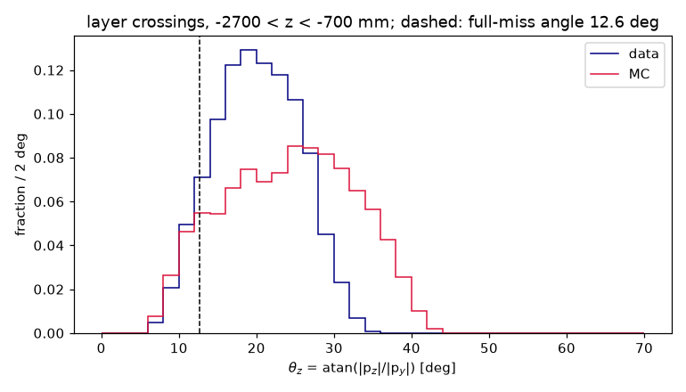 |
| 18: effective gap width vs theta_z | 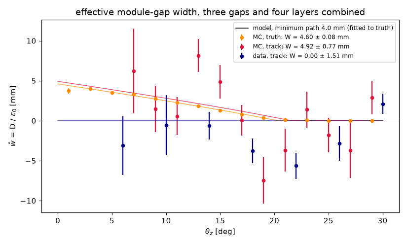 |
| 24: efficiency vs theta_z | 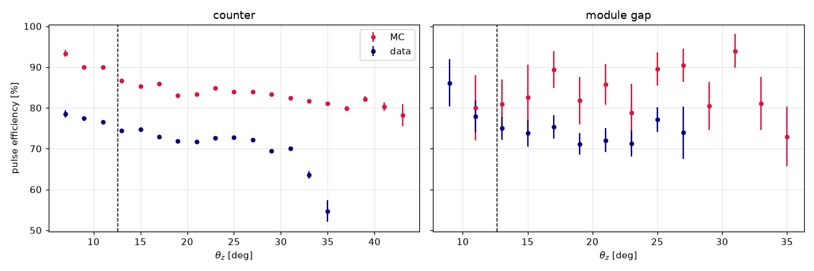 |
| new: MC extrapolation error by muon energy | 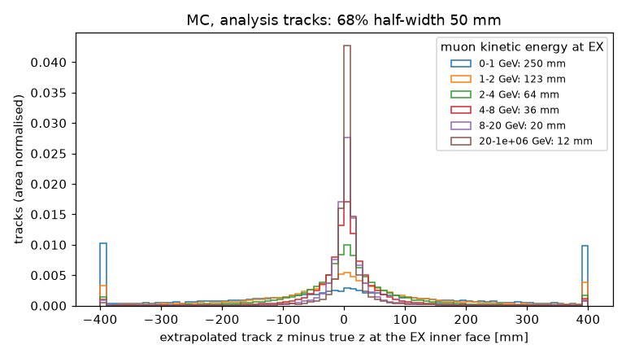 |
| new: narrow and wide hit along z | 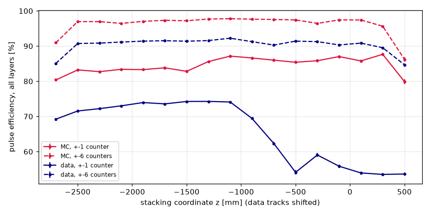 |
| new: template fit of the gap dip | 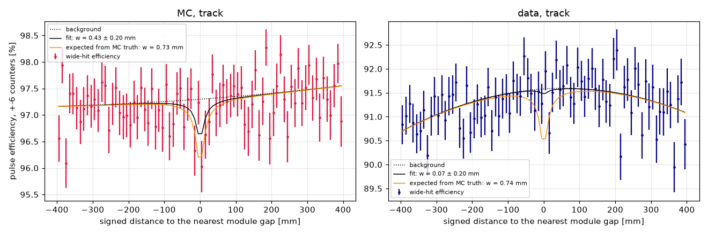 |

## Findings

1. **The MC is the slides' MC.** Every census number agrees: 334.5 tracks/s, 16.2% quality, 73.0% with n_planes >= 3, 39.6 analysis tracks/s. The data census does not agree, and should not: these are Offline PassN#21 tracks, the slides used daqana. This reconstruction finds 604.5 analysis tracks/s against 494.8, and its tracks point better: the EX coincidence dz core is 24 mm against 72 mm.
2. **The timing and the tracker displacement reproduce.** CRV - track is +498 ns (slides: +495), and the tracker sits 1197-1203 mm upstream of its nominal position (slides: 1190-1205).
3. **Track pointing at the CRV is limited by multiple scattering, not by the tracker.** In MC, the extrapolated track misses the muon's true crossing of EX by 50 mm (68% half-width), and the miss scales as 1/E: 250 mm below 1 GeV, 12 mm above 20 GeV. The angle between the track and the true direction at EX scales the same way, so this is scattering in the material between the tracker and the CRV, not tracker resolution. Which volumes of the extracted geometry do it was not traced. Two consequences:
   - The narrow hit (pulse within +-1 counter of the crossing) tops out at 84% in MC, as on the slides (83%). Within +-6 counters it is 97%.
   - A 4.4 mm gap cannot show as a dip in a track-based map. Here the MC-reco and data module-gap bins match the counters within errors. The slides show MC reco at 74% in the gaps against 83% in the counters (slides 12-14); with 50 mm pointing, that needs an explanation.
4. **The data efficiency drop beyond z of about -1000 mm (slide 15) is pointing, not the CRV.** The narrow hit falls from 74% to 54% there. The wide hit stays flat at 90-92% along the whole sector (`extra_narrow_vs_wide_z.png`), and pulse times and PE are the same there as elsewhere. Tracks reaching that end of the sector are scattered more.
5. **The data/MC gap ratio does not reproduce.**
   - With the slides' estimator, MC truth gives W = 4.60 +- 0.08 mm (nominal 4.433), and MC tracks 4.92 +- 0.77 mm, consistent.
   - Data give an all-angle width of -3.1 +- 0.8 mm, which no gap can produce. The data's wide-hit efficiency rises by up to 1% from the module centres to the module edges, over hundreds of mm, and the D/eps0 integral takes that for a negative gap. All three gaps show it (-1.8, -5.2 and -3.5 mm). The per-angle fit then sits at the physical limit, W = 0.0 +- 1.5 mm, and R is not determined.
   - A fit that allows a quadratic trend under a dip shaped like the MC smearing (`extra_template_fit.png`) finds the dip in MC at 0.43 +- 0.20 mm (0.73 expected). In data it finds 0.07 +- 0.20 mm, where MC-truth gaps would give 0.74: 3.3 sigma short.
   - So the data show less gap than MC, the same direction as the slides' R = 0.64 +- 0.18. But the size is not established: a data efficiency structure at the 1% level is not understood. Measuring the gap in data needs a method that does not rely on 50 mm pointing.
6. **Data are less efficient than MC everywhere, not only at gaps.** The EX coincidence plateau is 89.2% in data against 96.2% in MC (slides: 93.6% and 99.1%). The wide hit is 91% against 97%. So about 6% of data tracks find no in-time EX pulse within +-6 counters of their crossing in a given layer. Track quality (the data selection is looser), CRV calibration (`nearestMatch` from runs before 123913) or real inefficiency are all possible; not resolved here.

## Not covered

- Slide 3, the tracker panels read out: the ntuples here have no per-hit tracker branches. The panel map used has all 216 rows.
- Slides 2, 9 and 10 (drawings), and slide 11's 1 mm truth scan (slide 13's truth column, per bin, is here).
- Slide 23 (ntuples that lost unclustered pulses) does not apply: every pulse is kept.

## Outputs, as processed

`/exp/mu2e/data/users/oksuzian/claude-scratch/crv_gap/`: `run124155/` (225 ntuples and logs), `mc_au/` (100 ntuples and logs).
