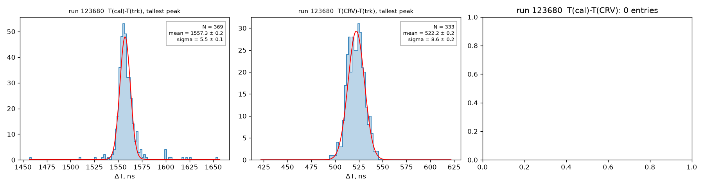
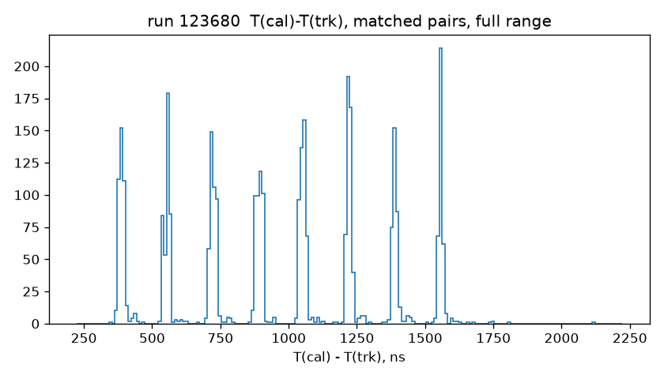
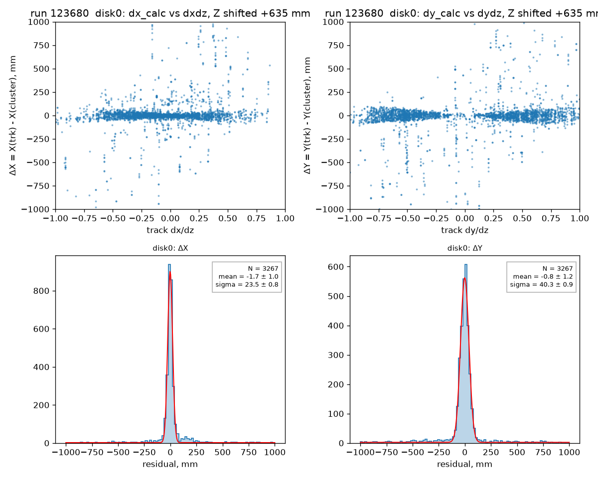
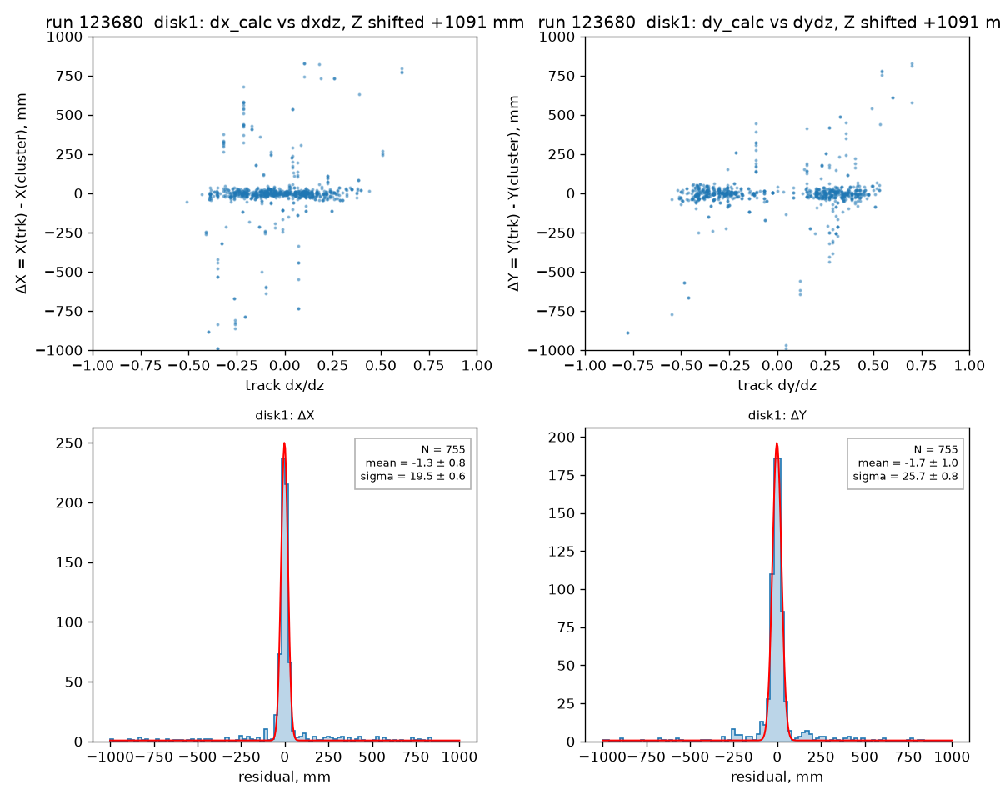
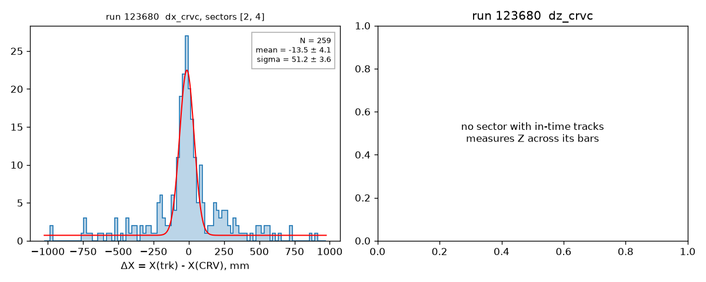
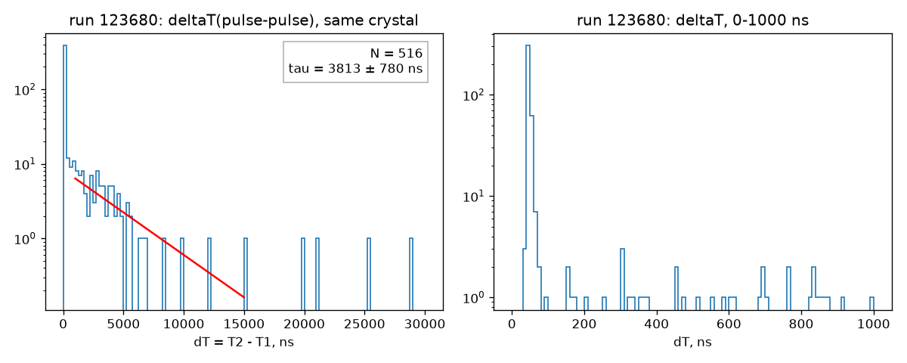
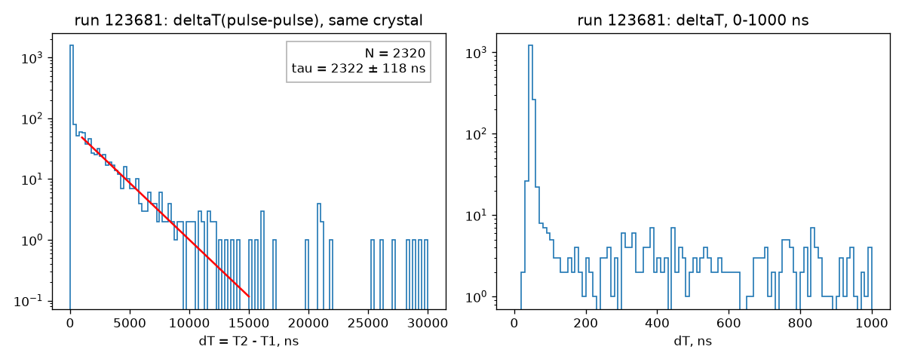
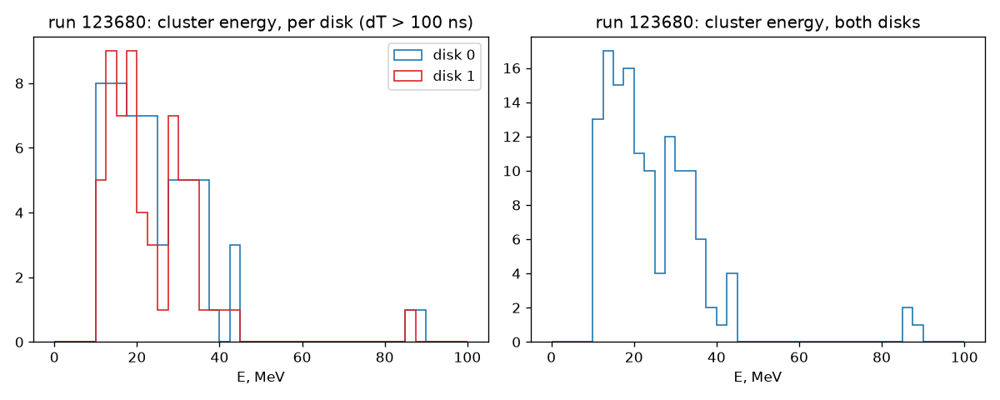
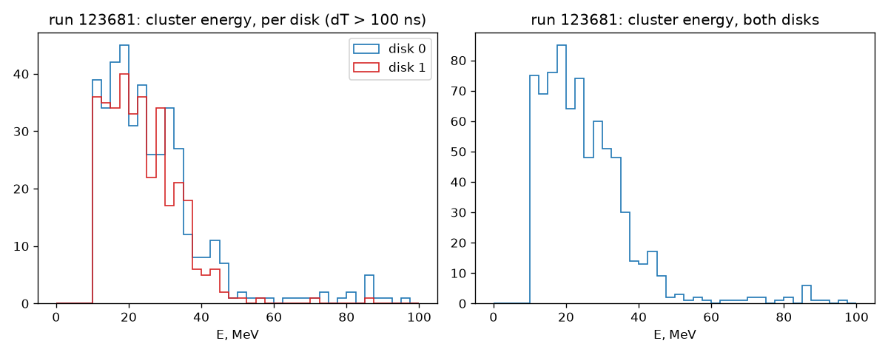

# KPP cosmics: timing, calorimeter and CRV positions, Michel decays

*Runs 123680 and 123681, processed 2026-10-01.*

This note reproduces the cosmic-run plots of P. Murat, "What can we learn from the cosmic run", [DocDB 58468](https://mu2e-docdb.fnal.gov/cgi-bin/sso/ShowDocument?docid=58468) (Oct 1 2026). It uses the standard Offline reconstruction, EventNtuple and an uproot analysis, and every step can be rerun from this folder.

## Data

| run | dataset | files | events | content |
|---|---|---|---|---|
| 123680 | `raw.mu2e.cosmics.kpp.art` | 1 (2.1 GB, subruns 1-1050) | 52,468 | tracker + calo + CRV, about 20 min live time |
| 123681 | `raw.mu2e.cosmics.kpp_calo.art` | 21 | 232,691 | calo only |

The files are tape-backed and read in place from `/pnfs`; never copy them. `scripts/rawpath.py` turns a file name into its path and shows how to check that a file is on disk.

## Software

One muse workdir holds all five repositories:

| repository | version | why |
|---|---|---|
| Offline | main 89bfebf + [#2022](https://github.com/Mu2e/Offline/pull/2022) = d07b6891 | #2022 fixes data calo times (see Findings 1) |
| Production | 7d83b5f | `JobConfig/reco/Extracted.fcl` |
| mu2e-trig-config | 0a2a90e | needed by Production; must be built (`gen/`) |
| EventNtuple | 7a85180 | |
| PassN | [#21](https://github.com/Mu2e/PassN/pull/21), `bonventre:tracker` 68a29c1 | `Combined_Pass1.fcl`, `from_mcs-combined.fcl`, temporary tracker calibrations |

Calibrations:
- **Calo:** `*_example.txt` placeholder tables.
- **Tracker:** R. Bonventre's temporary text tables, which cover runs 123660 and 123680 only.
- **CRV:** the database, purpose `CRV_COMMISSIONING` v1_0.

## Recipe

```bash
# 1. workdir (about 25 min to build with -j40)
mkdir kppwork && cd kppwork
source /cvmfs/mu2e.opensciencegrid.org/setupmu2e-art.sh
git clone https://github.com/Mu2e/Offline
git -C Offline fetch origin pull/2022/head:pr2022 && git -C Offline checkout pr2022
git clone https://github.com/Mu2e/Production
git clone https://github.com/Mu2e/mu2e-trig-config
git clone https://github.com/Mu2e/EventNtuple
git clone -b tracker https://github.com/bonventre/PassN      # until PassN#21 is merged
muse setup && muse build -j40

# 2. combined reco + EventNtuple with CRV pulses, run 123680 (12 parallel chunks, about 2 min)
scripts/combined_reco.sh kppwork $(python3 scripts/rawpath.py raw.mu2e.cosmics.kpp.123680_000001.art) out/run123680

# 3. calo-only reco + EventNtuple, run 123681 (21 parallel jobs, about 1 min)
python3 scripts/rawpath.py --kpp-calo 123681 1 201 10 > calo_123681.txt
scripts/calo_reco.sh kppwork calo_123681.txt out/run123681

# 4. plots and numbers (new shell)
source /cvmfs/mu2e.opensciencegrid.org/bin/pyenv.sh ana
python kpp_cosmic_plots.py out/run123680/nts.root -o plots/run123680
python kpp_cosmic_plots.py out/run123681/nts.root -o plots/run123681
```

The scripts fail loudly if any job fails. Each chunk or file keeps its `reco.log` and `nts.log`. `kpp_cosmic_plots.py` runs only the sections its input branches allow and lists what it skipped.

Combined reco keeps all events, without the raw fragments: `KalSeeds`, CRV digis, pulses and coincidences, calo hits and clusters, and the straw digis attached to tracks by `SelectReco`. Each output file carries about 83 MB of configuration and provenance copied from the raw input, while event data is about 6 kB per event.

## Analysis

`kpp_cosmic_plots.py` (uproot, awkward, scipy, matplotlib):
- **Tracks:** KinematicLine fits with N(active) ≥ 10. The straight line comes from the first `trksegs` entry (position, direction, time).
- **Frames:** EventNtuple stores `caloclusters.cog_` in the disk front-face frame. `calohits.crystalPos_`, `trksegs` and `crvcoincs.pos` are in the tracker frame. The disk-to-tracker offset is measured from single-crystal clusters and is checked to be a pure translation.
- **Time offsets** are measured: the peak of the raw difference, per CRV sector.
- **Disk Z (slides 6-7):** a plane scan finds the shift that maximises track-cluster matches within 60 mm. The residual-vs-slope is then fitted and zeroed, as on the slides.
- **CRV (slide 10):** per sector, the coordinate across the bars is the precise one, and it is found from the residual widths.
- **Michel (slides 13-14, 18):** 2-SiPM hits with E > 10 MeV, and two hits in one crystal. dT is the 2nd hit minus the 1st. The energy is that of the cluster holding the 2nd hit, with dT > 100 ns.

## Results

Every number below comes from `plots/run*/summary.json`.

| quantity | DocDB 58468 | this note |
|---|---|---|
| T(cal) - T(trk) | ~1600 ns (compensated offline), σ ≈ 5 ns (run 124680) | tallest peak 1557.3 ns, σ 5.5 ns; 8 peaks in total (Findings 3) |
| T(CRV) - T(trk) | ~500 ns | 522.2 ns, σ 8.6 ns |
| disk 0 residuals σx, σy | 1.5, 1.9 cm | 2.35, 4.03 cm |
| disk 1 residuals σx, σy | 1.7, 2.5 cm | 1.95, 2.57 cm |
| disk Z relative to Offline geometry | corrected, value not quoted | +635 mm (disk 0), +1091 mm (disk 1) |
| CRV σx | 5.5 cm | 5.1 cm (sectors 2 and 4) |
| CRV σz | 4.0 cm | not measurable in 123680 (Findings 4) |
| Michel τ | 2222 ns (run 123681) | 2322 ± 118 ns (run 123681), μ⁺ 2197 ns |
| Michel dT < 100 ns peak | overflow waveforms, "to be fixed" | 1551 of 2320 pairs |
| Michel cluster energy | Michel shape, ends near 50 MeV | same |

| slide | run 123680 | run 123681 |
|---|---|---|
| 4 timing |  | |
| 4, all calo-track peaks |  | |
| 6-7 disk 0 |  | |
| 8 disk 1 |  | |
| 10 CRV |  | |
| 13-14 Michel dT |  |  |
| 18 Michel energy |  |  |

## Findings

1. **Data calo times need Offline#2022.** On main, `CaloDigisFromDTCEvents` stores the DIRAC time in 5 ns ticks, and reco reads it as ns. Calo times then span 1-18.5 µs instead of 5-93 µs, and no calo-track time peak exists. Track-cluster positions still match. With #2022 the peak appears at once.
2. **The calorimeter disks are not where the Offline geometry puts them.** Matching tracks to clusters needs the disk plane moved by +635 mm (disk 0) and +1091 mm (disk 1) in the tracker frame. With that shift, disk-0 matches rise from 23 to 2,316. Because the two shifts differ, a single rigid tracker displacement does not explain them. Compare the preliminary survey on slide 10 ("tracker needs to be moved by ~1.2 m in Z").
3. **Calo time jumps per event in steps of about 167 ns.** T(cal) - T(trk) for matched pairs forms 8 sharp peaks at 389, 557, 723, 894, 1053, 1220, 1390 and 1557 ns. One crystal appears in several peaks, and the peak index does not correlate with event number, calo time or track time. So this is a per-event effect, not a per-channel calibration. Tracker and CRV agree to σ 8.6 ns. Cause unknown; to discuss with calo/DAQ.
4. **Only two CRV sectors see tracks in run 123680.** Sectors 2 and 4 show a sharp time peak at 522 ns. Both measure X across their bars; Z runs along the bar. Sectors 1 and 3 show no in-time tracks. So the slide-10 ΔZ plot, and the triple coincidences behind slide 4's T(cal) - T(CRV), cannot be reproduced from this run: the sectors that see tracks sit upstream (z ≈ -1.1 m) and the calorimeter downstream. The slides used run 124155 (CRV) and run 124680 (timing).
5. **Michel decays.** The lifetime fit agrees with μ⁺. The short-dT peak is mostly overflow waveforms (slide 15) and dominates the pairs. Run 123680 alone has too few pairs: 516 pairs give τ = 3.8 ± 0.8 µs.

## Not covered

- Slides 16-17 (event display), slide 20 (radiative μ and π capture in CsI) and slide 21 (long tracks through both disks).
- Runs 124155 and 124680, used on the slides for CRV and timing. They are not processed, because the tracker calibration tables cover only 123660 and 123680.

## Outputs, as processed

`/exp/mu2e/data/users/oksuzian/claude-scratch/kpp_reco_test/`:
- `full_123680_pr2022/`: reco and ntuple, run 123680.
- `calo_123681/`: run 123681.
- `recipe_check/`: the same, regenerated with the scripts in this folder; its `summary.json` files are identical to the first pass.
