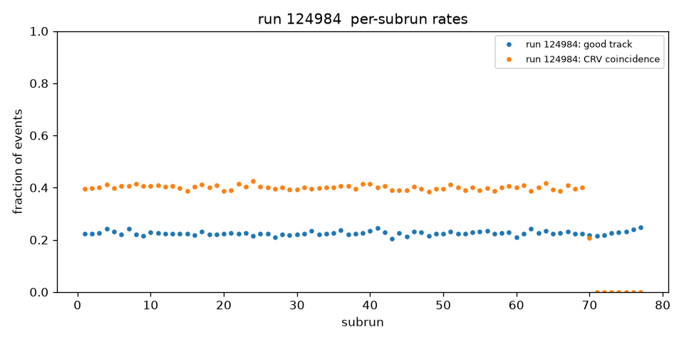
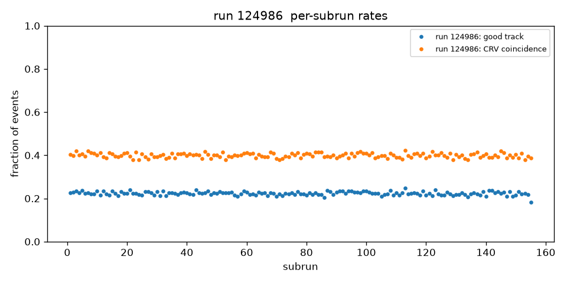
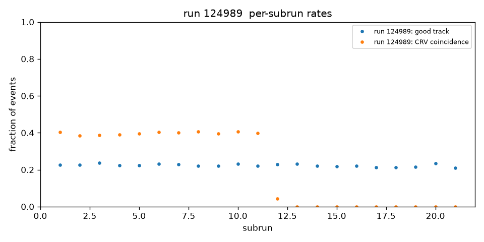
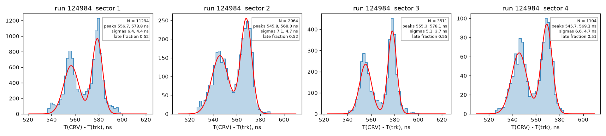
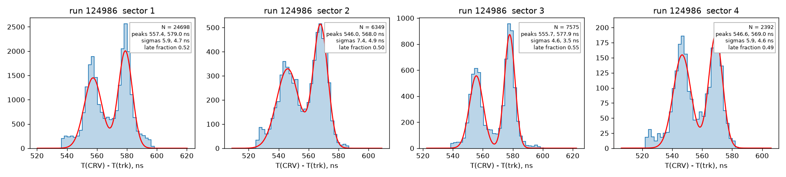
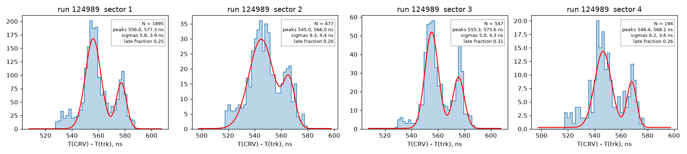
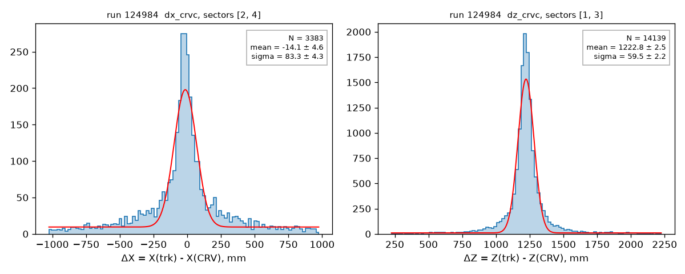
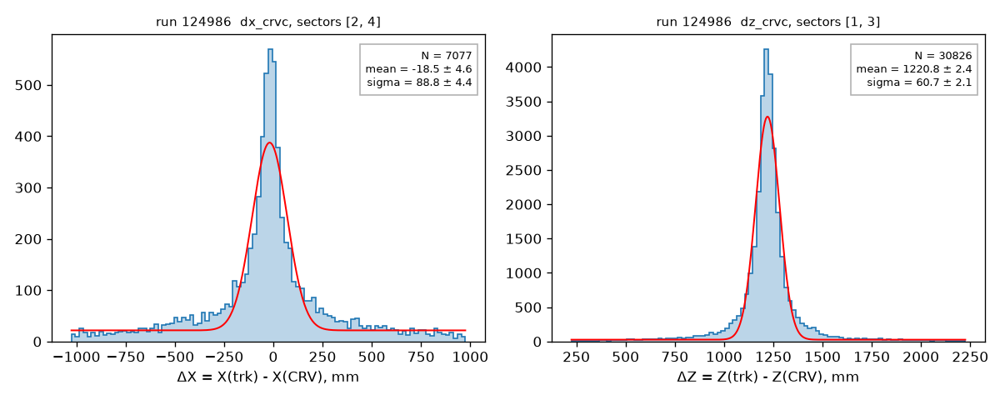
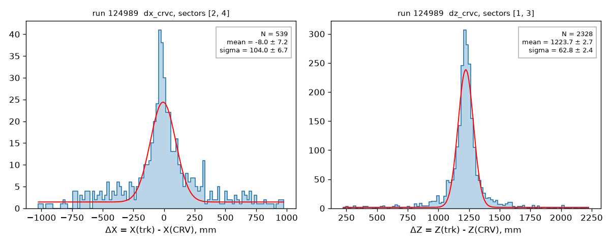

# KPP cosmics, `kpp_trk` runs: processing with PassN, tracker and CRV

*Runs 124984, 124986 and 124989, processed 2026-10-01.*

These are the first runs taken with the `kpp_trk` DAQ configuration. PassN's combined
pass1 ([PassN#21](https://github.com/Mu2e/PassN/pull/21)) does not process them as it
stands: CRV fails, then the tracker fails, and once both are patched the job exits 0
with no tracker hits at all. This note gives a recipe that works, explains the three
stopgaps it needs, checks that the tracker workaround reproduces the standard decoding
exactly, and shows first tracker-CRV results. Every step can be rerun from this folder.

## Data

| run | dataset | files | events | content |
|---|---|---|---|---|
| 124984 | `raw.mu2e.cosmics.kpp_trk.art` | 8 | 223,861 | tracker + CRV, no calorimeter |
| 124986 | `raw.mu2e.cosmics.kpp_trk.art` | 16 | 453,816 | tracker + CRV, no calorimeter |
| 124989 | `raw.mu2e.cosmics.kpp_trk.art` | 3 | 60,771 | tracker + CRV, no calorimeter |

`data/files.txt` lists the 27 files with their SAM event counts, as of 2026-10-01. Run 124989
may still have been growing then: its last file holds only 2,433 events. The files are
tape-backed and read in place from `/pnfs`; never copy them. `scripts/rawpath.py` turns a
file name into its path, and `--check` also prints whether the file is on disk.

Run 123680 (`raw.mu2e.cosmics.kpp.art`, from [kpp-cosmics-2026-10](../kpp-cosmics-2026-10/))
is used here as the reference for the tracker decoder check.

## Software

The muse workdir is the one of [kpp-cosmics-2026-10](../kpp-cosmics-2026-10/), unchanged:

| repository | version |
|---|---|
| Offline | d07b6891 (main 89bfebf + [#2022](https://github.com/Mu2e/Offline/pull/2022)); needs [#2003](https://github.com/Mu2e/Offline/pull/2003), merged 2026-09-28, for the `addressing` key |
| Production | 7d83b5f |
| mu2e-trig-config | 0a2a90e (built in the workdir) |
| EventNtuple | 7a85180 |
| PassN | [#21](https://github.com/Mu2e/PassN/pull/21), `bonventre:tracker` 68a29c1, cloned into the workdir |

## Stopgaps

`fcl/kpp_trk_pass1.fcl` is PassN's `Combined_Pass1.fcl` plus three overrides. Each one is
there because the job fails, or silently loses data, without it. None of them is a
calibration; they make the job run.

1. **CRV calibration.** `CRV_COMMISSIONING` v1_0 has no CRV constants past run 123913
   (`dbTool print-run` gives cid -1 for run 124984). The job stops with
   `DbEngine::update failed to find tid 25`. `services.DbService.nearestMatch: true`
   makes the CRV use the constants of the nearest preceding run, 123913.
2. **Tracker calibration.** PassN#21's `Tracker/trackercalibrations.txt` holds per-run
   tables (`TrkDelayPanel`, `TrkStrawStatusShort`, `TrkPanelStatus`) for runs 123660 and
   123680 only. The job then stops on tid 3, because `nearestMatch` does not apply to
   text-file tables. `scripts/env.sh` writes a copy in which the run-123680 tables cover
   runs 124000-129999.
3. **Tracker addressing.** Every tracker fragment in these runs carries
   `source_dtc_id = 0`, while `TrkPanelMap` lists DTCs 1-36 only.
   With PassN's `addressing: "byLink"` the decoder drops every ROC ("either dtc_id:0 or
   link_id:N is corrupted, skip ROC data"), and the job exits 0 with no StrawDigis.
   `addressing: "byMnid"` instead finds the panel from the MnID in each hit payload.
   Adding DTC 0 rows to the map cannot work: all the DTCs of an event report the same ID,
   so (DTC, link) no longer tells the panels apart.

## Recipe

```bash
# 1. muse workdir: as in ../kpp-cosmics-2026-10 (Offline, Production, mu2e-trig-config,
#    EventNtuple and PassN#21, all in one workdir in the app area), then muse build.
WORK=/exp/mu2e/app/users/$USER/kppwork
cd /exp/mu2e/app/users/$USER/AnalysisNotes/kpp-trk-2026-10
OUT=/exp/mu2e/data/users/$USER/kpp-trk-2026-10
mkdir -p $OUT

# 2. reco + EventNtuple with CRV pulses, one job per file; the three runs together are
#    27 parallel jobs, about 9 min on a 48-core machine, 8.5 GB of output
for r in 124984 124986 124989; do
  python3 scripts/rawpath.py $(awk -v r=$r '!/^#/ && index($1, "kpp_trk." r "_") {print $1}' data/files.txt) > $OUT/files_$r.txt
  scripts/kpp_trk_reco.sh $WORK $OUT/files_$r.txt $OUT/run$r &
done; wait

# 3. checks: tracker addressing A/B on run 123680 (about 1 min), calorimeter content
scripts/addressing_ab.sh $WORK $(python3 scripts/rawpath.py raw.mu2e.cosmics.kpp.123680_000001.art) $OUT/ab_123680
cp $OUT/ab_123680/addressing_ab.json plots/addressing_ab_123680.json
for f in raw.mu2e.cosmics.kpp_trk.124984_000001-001.art raw.mu2e.cosmics.kpp_trk.124986_000001-001.art \
         raw.mu2e.cosmics.kpp_trk.124989_000001-001.art raw.mu2e.cosmics.kpp.123680_000001.art; do
  scripts/calo_check.sh $WORK $(python3 scripts/rawpath.py $f) $OUT/calo_check
done
cp $OUT/calo_check/calo_check_*.json plots/

# 4. plots and numbers (new shell, in the note folder)
source /cvmfs/mu2e.opensciencegrid.org/bin/pyenv.sh ana
for r in 124984 124986 124989; do python kpp_trk_plots.py $OUT/run$r/nts.root -o plots/run$r; done
```

The scripts fail loudly: if a file is not on disk, if any job fails, or if the tracker
calibration file cannot be relabelled. Each job keeps its `reco.log` and `nts.log`.

**An exit code of 0 is not enough.** With PassN's addressing the job exits 0 and decodes no
tracker hits. `kpp_trk_reco.sh` prints the number of events passing `KLFilter` (events with
a line track); it must not be zero.

## Analysis

`kpp_trk_plots.py` (uproot, awkward, scipy, matplotlib):
- **Counts:** events with entries in each ntuple branch, and per-subrun fractions of events with
  a good track and with a CRV coincidence. A good track is a KinematicLine fit with N(active) ≥ 10.
- **Track-CRV:** the analysis of `../kpp-cosmics-2026-10/kpp_cosmic_plots.py` (DocDB 58468,
  slides 4 and 10), imported from there so both notes use the same code. For each CRV sector
  it finds the in-time track-CRV peak and picks the coordinate measured across the bars from
  the residual widths, then fits the residuals.
- **Timing:** T(CRV) - T(trk) has two peaks in every sector, so it is fitted per sector with two
  Gaussians (σ 1.5-10 ns, 12-35 ns apart). The fraction of pairs in the later peak is also
  computed per subrun, to see whether it drifts. `slide04_timing.png` keeps the single-Gaussian
  fit of the reference code, for comparison with the other note; it does not describe this
  distribution.

## Results

Every number below comes from `plots/run*/summary.json`, `plots/addressing_ab_123680.json`
and `plots/calo_check_*.json`. The run-123680 column is from
`../kpp-cosmics-2026-10/plots/run123680/summary.json`, made with the same track and CRV code.

| quantity | run 124984 | run 124986 | run 124989 | run 123680 |
|---|---|---|---|---|
| events | 223,861 | 453,816 | 60,771 | 52,468 |
| good tracks | 50,803 | 102,172 | 13,691 | 11,349 |
| good tracks per event | 0.227 | 0.225 | 0.225 | 0.216 |
| events with a CRV coincidence | 81,715 | 181,383 | 12,943 | – |
| events with calo hits | 0 | 0 | 0 | – |
| CRV sectors with in-time tracks | 1, 2, 3, 4 | 1, 2, 3, 4 | 1, 2, 3, 4 | 2, 4 |
| ΔX = X(trk) - X(CRV), sectors 2, 4 | -14.1 ± 4.6 mm, σ 83.3 mm | -18.5 ± 4.6 mm, σ 88.8 mm | -8.0 ± 7.2 mm, σ 104.0 mm | -13.5 mm, σ 51.2 mm |
| ΔZ = Z(trk) - Z(CRV), sectors 1, 3 | +1222.8 ± 2.5 mm, σ 59.5 mm | +1220.8 ± 2.4 mm, σ 60.7 mm | +1223.7 ± 2.7 mm, σ 62.8 mm | not measurable |
| T(CRV) - T(trk) | two peaks, below | two peaks, below | two peaks, below | one peak, 522.2 ns, σ 8.6 ns |

T(CRV) - T(trk), two-Gaussian fits per sector: early / late peak in ns, and the fraction of
pairs in the late peak.

| sector | run 124984 | run 124986 | run 124989 |
|---|---|---|---|
| 1 | 556.7 / 578.8, 0.52 | 557.4 / 579.0, 0.52 | 556.0 / 577.3, 0.25 |
| 2 | 545.8 / 568.0, 0.52 | 546.0 / 568.0, 0.50 | 545.0 / 566.0, 0.20 |
| 3 | 555.3 / 578.1, 0.55 | 555.7 / 577.9, 0.55 | 555.3 / 575.6, 0.31 |
| 4 | 545.7 / 569.1, 0.51 | 546.6 / 569.0, 0.49 | 546.4 / 568.1, 0.26 |
| late fraction per subrun: mean, rms (statistics alone) | 0.540, 0.041 (0.031) | 0.525, 0.047 (0.031) | 0.271, 0.053 (0.034) |

Tracker decoder A/B on run 123680 (`addressing_ab_123680.json`):

| | byLink (PassN) | byMnid (this note) |
|---|---|---|
| events | 52,468 | 52,468 |
| StrawDigis | 64,570,591 | 64,570,591 |
| events with identical digis | 52,468 | 52,468 |
| decoder errors or warnings | 0 | 0 |
| control, two MnIDs swapped in the map | | 497 of 500 events differ |

| plot | run 124984 | run 124986 | run 124989 |
|---|---|---|---|
| per-subrun rates |  |  |  |
| T(CRV) - T(trk) per sector |  |  |  |
| slide 10, track-CRV residuals |  |  |  |

## Findings

1. **PassN#21 does not process these runs as it stands.** The three stopgaps above are each
   needed. The third one fails silently: the job exits 0, with no tracker hits.
2. **`byMnid` reproduces the standard decoding exactly.** On run 123680, where both modes
   work, byLink and byMnid give the same StrawDigis in every one of 52,468 events
   (64,570,591 digis: straw ID, both TDCs, both TOTs, PMP), with no decoder errors. Swapping
   two MnIDs in the map changes 497 of 500 events, so the comparison does see the panel
   assignment. What byMnid gives up is the decoder's cross-check of the MnID in the data
   against the cabling. That check comes back once the DAQ writes real DTC IDs.
3. **No calorimeter data in `kpp_trk`.** The calo decoder finds no calorimeter subsystem data
   in 100 of 100 events of each run (12 of 100 for run 123680), and no event has calo hits.
4. **The CRV data stop partway through two runs.** CRV coincidences vanish from subrun 71 of
   run 124984 (77 subruns) and from subrun 12 of run 124989 (21 subruns). The track rate does
   not change, so the tracker keeps running. Run 124986 keeps its CRV data in all 155 subruns.
5. **T(CRV) - T(trk) has two peaks, 20-23 ns apart, in every sector of every run.** In runs
   124984 and 124986 about half the pairs are in the later peak; in run 124989 about a quarter.
   Within a run the split hardly moves from subrun to subrun: the rms of the per-subrun
   fraction is close to what statistics alone give. Sectors 2 and 4 sit about 10 ns earlier
   than sectors 1 and 3. In sectors 2 and 4, run 123680 has a single peak at 522 ns
   (σ 8.6 ns); here the two peaks sit 23-25 ns and 44-47 ns later. The cause is unknown. Two things differ
   from run 123680 and this note cannot separate them: the CRV time calibration borrowed from
   run 123913, and the `kpp_trk` DAQ configuration (the same one that writes DTC ID 0).
6. **All four CRV sectors see tracks, so ΔZ can be measured.** In run 123680 only sectors 2
   and 4 did. Sectors 1 and 3 give ΔZ = Z(trk) - Z(CRV) = +1.22 m with σ about 60 mm, the same
   in all three runs. That is a geometry offset between tracker and CRV in the Offline
   description, of the size quoted on DocDB 58468 slide 10 ("tracker needs to be moved by
   ~1.2 m in Z"); compare the calorimeter disk shifts in
   [kpp-cosmics-2026-10](../kpp-cosmics-2026-10/), Findings 2.
7. **ΔX is wider than in run 123680:** σ 83-104 mm against 51 mm, with the same code. The
   distribution has a narrow core with broad shoulders, which the single Gaussian absorbs.

## Not covered

- Tracker and CRV calibrations for these runs. All three stopgaps borrow from other runs.
- The calorimeter: these runs carry no calorimeter data.
- Track quality versus the run-123680 reference beyond the counts above. The tracker
  constants are borrowed from run 123680.

## Outputs, as processed

`/exp/mu2e/data/users/oksuzian/claude-scratch/kpp_trk_2026_10/`:
- `run124984/`, `run124986/`, `run124989/`: reco and ntuple per file (`fNN/`), merged
  `nts.root` and `crvdqm.root`.
- `ab_123680/`: the addressing A/B. `calo_check/`: the calorimeter check.
